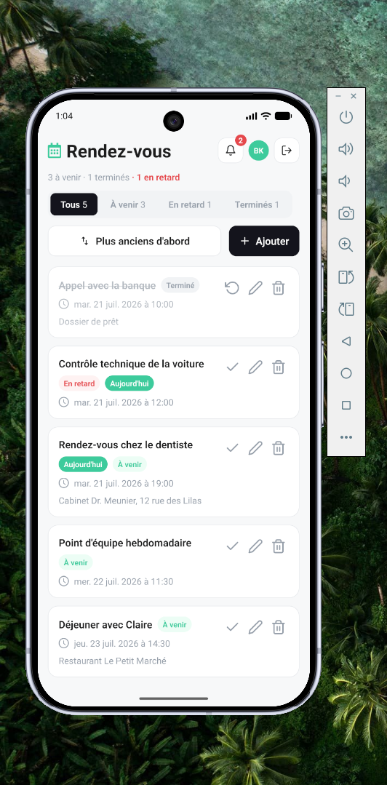

# Rendez-vous

A mobile app for planning, tracking and managing personal appointments —
*planifiez, suivez et gérez tous vos rendez-vous au même endroit*.

Sign in with Google, add your appointments, and see at a glance what is coming
up, what is happening today, and what you have let slip. The interface is in
French.

<p align="center">
  
</p>

## Features

- **Google sign-in**, backed by Appwrite accounts
- **Appointments** with a title, date, time and free-text notes
- **Derived status** — `À venir`, `Aujourd'hui`, `En retard` and `Terminé` are
  computed from the date and completion state, so a pending appointment slips
  into "en retard" on its own as time passes
- **Filter and sort** by status, oldest or newest first
- **Upcoming bell** showing what is due today and tomorrow
- **Local reminders** three days, one day and three hours before each
  appointment, scheduled on-device so they fire offline

## Screenshots

| Sign in | Appointments |
| :-----: | :----------: |
|  |  |

| New appointment | Upcoming |
| :-------------: | :------: |
|  |  |

## Stack

- [Expo](https://expo.dev) SDK 57 with [expo-router](https://docs.expo.dev/router/introduction/)
  file-based routing
- React Native 0.86, React 19, TypeScript in strict mode
- [Appwrite](https://appwrite.io) Cloud for auth and data
- React Compiler and typed routes enabled

## Getting started

You need Node 20+, and an Appwrite project with a database.

```bash
git clone https://github.com/btkdevkh/rdv.git
cd rdv
npm install
cp .env.example .env     # then fill in your Appwrite IDs
npm start
```

Press `a` for an Android emulator, `i` for iOS, or scan the QR code with
[Expo Go](https://expo.dev/go).

**The backend needs setting up first** — registering the platform, enabling
Google OAuth, and creating the `appointments` table. That is walked through
step by step in **[docs/appwrite-setup.md](docs/appwrite-setup.md)**.

The table schema lives in [`appwrite.config.json`](appwrite.config.json) and is
applied with the Appwrite CLI rather than clicked together by hand:

```bash
npm run appwrite:push
```

### Local reminders

Reminders need a development build — Expo Go dropped Android notification
support in SDK 53, so they are switched off there automatically.

```bash
npx expo run:android
```

### Building an installable APK

```bash
npx eas build --platform android --profile preview
```

## Scripts

| Command             | Purpose                              |
| ------------------- | ------------------------------------ |
| `npm start`         | Expo dev server                      |
| `npm run android`   | Open on a connected Android device   |
| `npm run ios`       | Open on an iOS simulator             |
| `npm run web`       | Run in a browser                     |
| `npm run typecheck` | `tsc --noEmit`                       |
| `npm run lint`      | ESLint                               |
| `npm run format`    | Prettier over `src/`                 |
| `npm run appwrite:push` | Apply the database schema        |

## Project structure

```
src/app/          Routes. Thin screens — layout and wiring only.
src/components/   Generic presentational components.
src/features/     Domain code by feature (auth, rdv): state, repository, types.
src/hooks/        Shared hooks.
src/constants/    Design tokens and environment config.
src/lib/          Appwrite client.
src/utils/        Pure helpers.
```

## Contributing

Conventions, the branching model and the design rules live in
**[AGENTS.md](AGENTS.md)**. In short: branch from `develop`, keep `npm run
typecheck` and `npm run lint` green, check any UI work against the web design
in `context/screenshots/web/`, and land changes on `main` through a pull
request from `develop` rather than a local merge.

## Licence

MIT — see [LICENSE](LICENSE).
